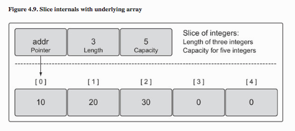

# goref
A quick reference for the go language.

This started as an incomplete blogpost that never saw the light of day, so rather than let that rot, this will be a semi-living document that will be updated as needed.

Other than specific citations, most of the following is simmered down from the following sources:

- [An Introduction to Programming in Go](http://www.golang-book.com) by [Caleb Doxsey](http://www.doxsey.net)

  <a href="http://www.golang-book.com"></a>
- [The Go Programming Language](http://www.gopl.io) by [Donovan](https://github.com/adonovan) and [Kernighan](https://www.cs.princeton.edu/~bwk/).

  <a href="http://www.gopl.io"></a>
- [Go In Action](https://www.manning.com/books/go-in-action) by [William Kennedy](https://www.goinggo.net), [Steve Francia](http://spf13.com) and [Erik St. Martin](https://twitter.com/erikstmartin).

  <a href="https://www.manning.com/books/go-in-action"></a>
- [How to Write Go Code][how-url]
- [Effective Go][effective-url]
- [Golang FAQ][faq-url]
- [Rob Pike - From Parallel to Concurrent](https://channel9.msdn.com/Events/Lang-NEXT/Lang-NEXT-2014/From-Parallel-to-Concurrent)
- [Rob Pike - Concurrency Is Not Parallelism](https://www.youtube.com/watch?v=cN_DpYBzKso)
- [Go by Example](https://gobyexample.com)
- [talks.golang.org](https://talks.golang.org)
- [The Go Programming Language](https://www.youtube.com/watch?v=rKnDgT73v8s) (The original presentation)
- [dotGo 2015 - Rob Pike - Simplicity is Complicated](https://www.youtube.com/watch?v=rFejpH_tAHM)

[how-url]: https://golang.org/doc/code.html
[effective-url]: https://golang.org/doc/effective_go.html
[faq-url]: https://golang.org/doc/faq

## Install

Install using a rolling package manager:

```sh
$ brew install go #OSX
```

```sh
C:> choco install golang #Windows
```

```sh
$ sudo pacman -S go #Arch Linux
```

The prebuilt binaries are also a good option for linux.  Don't get stuck using an old version.

[golang.org/dl](https://golang.org/dl/)

You also need to install `git` and `hg`.  Quite a few official packages are versioned with `hg`.

## Configure

Go expects two primary `ENV` vars to be set:

### $GOROOT

`GOROOT` needs to be set to where you installed go.  In most cases, this will automatically be set by the package manager, or if you installed the prebuilt bins to the default location.  Otherwise you need to set this in your dotfiles.  See [golang.org/doc/install#tarball_non_standard](https://golang.org/doc/install#tarball_non_standard)

### $GOPATH

The `GOPATH` path needs to be set every time unfortunately.  This seems to be the convention:

```sh
$ mkdir -p ~/go/{bin,src} ; echo "export GOPATH=\$HOME/go" >> ~/.bashrc ; echo "export PATH=\$PATH:\$GOPATH/bin" >> ~/.bashrc
```

This should add the following lines to your `.bashrc`

```sh
# add to ~/.bashrc to make the above action stik
export GOPATH=$HOME/go
export PATH=$PATH:$GOPATH/bin
```

The `GOPATH` enables the `go get` command which downloads and build packages from git repositories.  They get built and installed to your `GOPATH`.  You pretty much always want to run the `bin`s they come along with so adding `$GOPATH/bin` to the `PATH` is critical.

For this document assume:

```sh
$GOPATH = ~/go
```

## Basic Go Packaging

Read the entire "[How to Write Go][how-url]" document,  but here are the basics:

Develop your code in the `src` folder corresponding to where you host your code:

```sh
~/go/src/github.com/bcomnes/project-name
```

You can quickly create new projects by creating the repo on github, then `go get [repo-qualified-name]` the newly created repo:

```sh
go get github.com/bcomnes/project-name
```

> - Go programmers typically keep all their Go code in a single workspace.
- A workspace contains many version control repositories (managed by Git, for example).
- Each repository contains one or more packages.
- Each package consists of one or more Go source files in a single directory.
- The path to a package's directory determines its import path.
---[How to Write Go Code](https://golang.org/doc/code.html#Overview)


Every folder can house a single package.  Sub-packages can live in subfolders of a package.

```sh
/package/
  foo.go
  bar.go
  /subpackage/
    beep.go
    boop.go
```

Packages are a single file or collection of files that start with the `package` header.

```go
package foo
```

Every package file must have the same package name as their siblings in the folder that they live in.  Having a different package declaration name than siblings results in an error.

Every source file in your project must have a package header.

Packages that generate executable commands must always be named `package main`.

```go
package main
```

`package main` must contain a `main()` function, which is called when you execute the program.

```go
package main

import "fmt"

func notmain() {
  fmt.Println("I don't run unless called!")
}

func main() {
  // Hi I'm the entry point
  fmt.Println("Hello world")
}
```

File names are mostly irrelevant.  Packages are referenced by their directory path in `$GOPATH`:

```go
import (
  "fmt"
  "github.com/bcomnes/package-folder"
)
```

where `github.com/bcomnes/package-folder` has the following files:

```sh
/package-folder/
  package-file1.go
  package-file2.go
```

When you import a package by its dir path, the package name from the package declaration at the top of the package files becomes the prefix at which you can access everything that is exported from that package. e.g.

If `package-file1.go` from  `github.com/bcomnes/package-folder` had the following contents:

```go
//package-file1.go
package foo

import "fmt"

func Say( ){
  fmt.Println("Hi from foo")
}

```

then another go package importing this would import it like this:

```go
package bar

import "github.com/bcomnes/package-folder"

foo.Say() //Hi from foo
```

The package name `foo` is silently and invisibly dropped into the scope of the importing package as a package prefix.  You can name your imports by giving them a name upon importing

```go
package bar

import pf "github.com/bcomnes/package-folder"

pf.Say() //Hi from foo
```

Its generally a good idea to keep your package folder name the same as the package name, but know that you cannot depend on this to be true necessarily.

> Go's convention is that the package name is the last element of the import path: the package imported as "crypto/rot13" should be named rot13. --[How to Write Go Code#PackageNames](https://golang.org/doc/code.html#PackageNames)

Many packages will leave their main package in the root of their project repo, because their primary product is a binary program installed with the `go get` command.

Packages export things to importers by capitalizing the first letter of the variable or function they are exporting.  Package files have intrinsic access to the variables and types declared anywhere else in the package siblings.  This is unfortunate, so please take this in mind and make declarations obvious, and possibly even be reluctant when creating multi-file packages.


### Testing

Go includes first class testing tools. To write a test for a package, create a file with the same name but suffixed with `[file-name-to-test]_test.go`.

```
/package
  foo.go
  foo_test.go
```

A test is a function that takes a test assertion pointer `*testing.T`:

```go
// math_test.go
package math

import "testing"

func TestAverage(t *testing.T) {
  var v float64
  v = Average([]float64{1,2})
  if v != 1.5 {
    t.Error("expected 1.5, got ", v)
  }
}
```

Notice that `Average` is not imported.  Since tests are apart of the package namespace itself, all top level functions and variables available to tests as well as every other file in the package.  On some level, this is nice since we can test un-exported functions without having to expose them publicly.  Its unfortunate because we have to be aware of invisible namespace overlap between files.

To run tests, type:

```
$ go test
```

All tests found in the current package folder will be run.  Tests are identified by the public `Test` prefix on functions.  Typically you put the name of the function you are testing after `Test` like `TestAverage` for testing the `Average` function.

A common testing pattern is to write a test that takes a struct of inputs and outputs, and loop through an array of these.


```go
package math_test

import "testing"

type testpair struct {
  values []float64
  average float64
}

var tests = []testpair{
  { []float64{1,2}, 1.5 },
  { []float64{1,1,1,1,1,1}, 1 },
  { []float64{-1,1}, 0 },
}

func TestAverage(t *testing.T) {
  for _, pair := range tests {
    v := Average(pair.values)
    if v != pair.average {
      t.Error(
        "For", pair.values, "expected", pair.average, "got", v
      )
    }
  }
}
```

### Vendoring

Vendoring is up in the air still but generally here are the best leads:

- Most official version aware vendoring tool https://github.com/golang/dep
- [schmichael](http://schmichael.com/) recomends https://github.com/robfig/glock for vendoring
- There is a [vendoring experiment going on in 1.5](https://golang.org/doc/go1.5) with the following [design document](https://docs.google.com/document/d/1Bz5-UB7g2uPBdOx-rw5t9MxJwkfpx90cqG9AFL0JAYo/edit?usp=sharing):

#### More info

- [SO: What is a sensible way to layout a Go project](http://stackoverflow.com/questions/14867452/what-is-a-sensible-way-to-layout-a-go-project)

## Basic Go CLI

Run `go` files with `go run`:

```sh
$ go run /path/to/foo.go
```

Get docs using `godoc`:

```
$ godoc fmt Println
func Println(a ...interface{}) (n int, err error)
    Println formats using the default formats for its operands and writes to
    standard output. Spaces are always added between operands and a newline
    is appended. It returns the number of bytes written and any write error
    encountered.
```


Download and build dependencies with `go get`:

```sh
$ go get github.com/ipfs/go-ipfs/cmd/ipfs
```

`go get` has a few flags:

- `-h`: display extended help info
- `-d`: download package only (no install)
- `-t`: download package with tools necessary for testing
- `-u`: update package and dependencies

## Common Types

Go is a typed language.  You can specify to the compiler the datatype of the variable.  If you try to assign type a to a variable of type b, the compiler throws an error.

### Numbers

- `uint8` (`u` means unsigned e.g. no `+/-`)
- `uint16`
- `uint32`
- `uint64`
- `int8`
- `int16`
- `int32`
- `int64`
- `float32`
- `float64`
- `complex64`
- `complex128`

### Strings

Double quotes (`"string"`) requires escaped whitespace:

```go
x := "String \n with \n newlines and \t tabs"
```

Backticks (``string``) can contain whitespace

```go
x := `String
with
whitespaces`
```

Simple concatination of strings can be done with the `+` operator:

```go
x := "string1 "
y := "string2"
z := x + y // "string1 string2"
```

### Booleans

Same as JS:

- `&&` and
- `||` or
- `!` not

### Type Conversions

Types can be converted different types by running the variable through the desired type as a function.

For example, turning an `int` into a `float64`

```go
var x int = 32
var xFload64 = float64(x)
```

## Variables

Generally try to create varibles by inferring their type using the `:=` operator:

```go
x := "This results in x being a string"
```

You can think of this as stating:

> Create a variable who's type and value is the following -- [Rob Pike: Advanced Topics in Programming Languages: Concurrency/message passing Newsqueak](https://youtu.be/hB05UFqOtFA?t=9m42s)

Here is an example `go` program:

```go
package main

import "fmt"

func main() {
  var x string
  x = "Hi I'm a string"
  var y = "I'm an inferred string"
  z := "Beep another inferred string"
  i := "var not required!"
  fmt.Println(x) // Hi I'm a string
  fmt.Println(y) // I'm another string
  fmt.Println(z) // Beep another string
  fmt.Println(i) // var not required!
}
```

Variables are created using the `var` keyword, followed by the variable name (`x`) followed by the variable type.

`var` and the `:=` assignment operator can infer the correct type in most cases when a type is omitted.

```go
// Simple typed variables
var x string = "hello i'm variable of type string"
var y int16 = 32
var z = "var can infer type"
i := 32
```

### Naming variables

Variable names must start with a letter and can contain letters, numbers and the underscore symbole (`_`).

Unused variables throw errors and warnings.  If a variable is named (`_`), the go compiler will not complain if it is unsed.  There should never be unused named variables.

### Simple operators

Simple operators work on most variables of the same type.

- `+`: addition
- `-`: subtraction
- `*`: multiplication
- `/`: division
- `%`: modulo (remainder)
- `x += x = x + x` increment
- `x -= x = x - x` decrement
- `==` equal
- `!=` not equal

### Scope

Go is "[lexically scoped using blocks]()"[citation needed].

Variables exist inside the braces(`{}`) where they are defined, as well as in any child braces(`{}`).

A block is the code inside a pair of braces(`{}`).

### Constants

Declair constants using the `const` keyword in the same maner as the `var` keyword.

```go
const x string = "go ahead, just try to reassign me"
```

Try to avoid using constants where configuration and configurable defaults would also work.  E.G. you never need to configure something like `Pi`(π) (defined as `const` in the `math` package).

### `var` definition shorthand

The following is a common code pattern when defining variables.

```go
var (
  a = 5
  b int64 = 6
  c = "a string"
)
```

This pattern works with other keywords that are used similarly to the `var` keyword.

## Basic `fmt` usage

### Basic line printing

- `fmt.Println('print something to stdout')`: log to stdout with a newline at the end.
- `fmt.Println('hi my name is', name)`: appending string together with a space.
- `fmt.Print('no newline')`: print without a trailing newline.


### Process input

- `fmt.Scanf("%f", &var_name)`: Wait for `stdin` and write to `&var_name`.
  - See pointers for info on the `&` prefix.

```go
package main

func main() {
  fmt.Print("Enter a number: ")
  var input float64
  fmt.Scanf("%f", &input)

  output := input * 2

  fmt.Println(output)
}
```
## Control Structures

Go has 3 simple control stuctures that can be used in many ways.

### `for` loops

Go only has 1 type of loop: the `for` loop.   As with most languages, `for` loops repeat a block of code multiple times.

```go
package main

import "fmt"

func main() {
  first()
  second()
  three()
}

func first() {
  // minimal for loop
  i := 1
  for i <= 10 {
    fmt.Println(i)
    i += 1
  }
}

func second()  {
  // A more common an concise declaration
  for i := 11; i <= 20; i++ {
    fmt.Println(i)
  }
}

func three()  {
  for i := 19; i >= 0; i-- {
    fmt.Println(i)
  }
}
```

If we have an iterable variable like an array or slice we can use the `range` keyword as a shorthand in our `for` loop.

```go
package main

import "fmt"

func main() {
  x := [5]float64{1,2,3,4,5}
  var total float64 = 0

  for _, value := range x {
    total += value
  }

  fmt.Println(total / float64(len(x))) // 3
}
```

### `if` statements

If blocks work similarly to js, except there are some minor syntax differences:

```go
package main

import "fmt"

func main() {
  for i := 0; i <= 10; i++ {
    if i % 2 == 0 {
      fmt.Println(i, "divisible by 2")
    } else if i % 3 {
      fmt.Println(i, "divisible by 3")
    } else {
      fmt.Println(i, "beepin beep")
    }
  }
}
```

### `switch` blocks

Switches look for a matching case top down and break once a match is found.  There is no fallthrough [[Citation Needed]]().

Switches also support a default case if no match is found.

Generally avoid switch statements.

```go
package main

import "fmt"

func main() {
  mySwitch(0)
  mySwitch(1)
  mySwitch(2)
  strSwitch("boop")
  strSwitch("foo")
}

func mySwitch(i int) {
  switch i {
  case 0: fmt.Println("0")
  case 1: fmt.Println("2")
  case 2: fmt.Println("2")
  }
}

func strSwitch(i string) {
  switch i {
  case "boop": fmt.Println("beep")
  case "foo": fmt.Println("bar")
  }
}
```

## Arrays

Arrays are an ordered (numbered) sequence of elements of a single type with a fixed length.  Once created, they cannot be resized.

```go
package main

import "fmt"

func main() {
  var x [5]int
  x[4] = 100 // set 5th element (i = 4) to 100
  fmt.Println(x) // [0 0 0 0 100]
  var length = len(x)
  fmt.Println(length)
}
```

The length of an array is accessed using the built in `len(array)` function returning the length as an `int`.

Arrays can also be created with the following shorthand:

```go
x := [5]int{ 1, 2, 3, 4, 5 }
y := [5]float32 {
  98,
  93,
  80,
  52,
  56, // Trailing comma REQUIRED
  //45, // to allow commenting out elements
}
```

Use `range` in a for loop to iterate over an array:

```go
x := float64[5]
// ... assign some stuff
for i, el := range x {
  // i is index
  // el is i'th element
}
```

## Slices

Similar to type inference, you can create an array and infer its length upon creation.  This is generally preferred over specifying length manually the same way `:=` is preferred when possible.

```go
arr := []float64{1,2,3,4}
// creates a slice with an underlying array of length 4
```

When you create an array this way, you are actually creating a slice.

Slices are 'slices' of arrays.  Slices can be shorter than their underlying array and change in length (increase and decrease) but cannot exceed the length of the underlying array.

```go
var x []float64
// Creates a slice x of length 0
fmt.Println(len(x)) // 0
```

You can also make slices using the `make` keyword:

```go
x := make([]float64, 5)
// creates a slice with underlying array length of 5
y := make([]float64, 5, 10)
// A slice of length 5 with an underlying array of length 10
```



(Image taken from Go In Action book.)

Slices are pretty complicated, but easy to use.  The Go Programming Language and Go In Action books both have excellent in depth explanations of how they work internally, and some underlying subtleties in how they behave.

### Slicing

Using the slice syntax, you can slice up existing arrays and create a slice of a range.

```go
// array[low:high]
arr := []float64{1,2,3,4,5,6,7,8,9}
s := arr[0:5] // [1 2 3 4 5]
t := arr[1:6] // [2 3 4 5 6]
```

The `low` index is where the slice starts and the `high` index is where the slice stops.  The `high` index is **not** included.


### Appending

The `append` function accepts a slice and additional values to append.  It returns a new slice with with those values appended.

```go
slice := []float64{1,2,3,4,5} // [1 2 3 4 5]
biggerSlice := append(slice, 6,7,8,9) // [1 2 3 4 5 6 7 8 9]
```

### Copying

The `copy` function copies as much as one slice into another slice:

```go
func copyTest() {
	slice1 := []int{1, 2, 3, 4}
	slice2 := make([]int, 2)
  var slice3 []int
	copy(slice2, slice1)
  copy(slice3, slice1)
  slice2[0] = 2
	fmt.Println(slice3, slice2, slice1) // [] [2 2] [1 2 3 4]

	slice4 := slice1 // Assignments are copy by reference
	slice4[0] = 10
	fmt.Println(slice4, slice1) // [10 2 3 4] [10 2 3 4]
}
```

## Maps

AKA: "Hash Table", "Dictionary" or "Associative Array".  An unordered collection of keys-value pairs.

```go
x := make(map[string]int)
/*    ^    ^     ^    ^
      |    |     |    |
    init   |     |    |
         keyword |    |
                 |    |
                 |    |
             key type |
                      |
                 value type
*/
```

Maps need to be initialized before they can be used using the `make` keyword.  The shorthand method is preferred in general.

Functions like `len` work on maps.

Keys can be deleted using the `delete(map, keyName)` function.

Values are accessed similar to how we access arrays using the `map["key"]` syntax.

```go
package main

import "fmt"

func main() {
	x := make(map[string]string)
	x["key"] = "10"
	fmt.Println(x["key"]) // "10"
	fmt.Println(len(x)) // 1
	x["foo"] = "bar"
}
```

Accessing keys that don't exist returns the zero value of the value type:

```go
y := make(map[string]string)
z := make(map[int]int)
fmt.Println(y["foo"] == "") // true
fmt.Println(z[10] == 0) // true
```

Testing for key existence is easy due to a secondary Boolean existence return value:

```go
h := make(map[string]string)
h["beep"] = "boop"

noise, ok := h["beep"]
fmt.Println(noise, ok) // boop true
noNoise, ok  := h["foo"]
fmt.Println(noNoise, ok) // '' false
```

When used in an `if` condition:

```go
h := make(map[string]string)
h["beep"] = "boop"

if noise, ok := h["beep"]; ok {
  fmt.Println(noise) // boop
}

if noise, ok := h["bar"]; ok {
  // Doesn't run
  fmt.Println(noise)
}
```

### Map shorthand

The preferred way of making maps is with the shorthand syntax:

```go
myMap := map[string]string {
  "hey": "hi",
  "beep": "boop",
  "foo": "bar",
  "bleep": "blop", // trailing comma required
}
fmt.Println(myMap) // map[hey:hi beep:boop foo:bar bleep:blop]
```

### Maps of maps

We can create maps of maps like this:

```go
mapOfMap := map[string]map[string]int {
  "hey": {
    "beep": 10,
    "boop": 20,
  },
  "hi": {
    "beep": 30,
    "boop": 40
  }
}
fmt.Println(mapOfMap) // map[hey:map[beep:10 boop:20] hi:map[boop:40 beep:30]]
```

*Note:* Maps of maps used to require a more verbose syntax:

```go
oldMapOfMap := map[string]map[string]int {
  "hey": map[string]int{
    "beep": 10,
    "boop": 20,
  }
}
fmt.Println(mapOfMap) // map[hey:map[beep:10 boop:20] hi:map[boop:40 beep:30]]
```

This is no longer so as of Go 1.7 and a little earlier.  Just make sure you are running the latest go.

## Functions

A simple function example looks like:

```go
func average(xs []float64) float64 { panic("Not Implemented") }
/*^    ^     ^      ^        ^     ^
  |    |     |      |        |     |
keyword|     |      |        |     |
       |     |      |        |     |
     name    |      |        |     |
           arg1  arg-type    |     |
                             |     |
                       return-type |
                                   |
                            function-
*/
```

The combination of the function's arguments(AKA parameters) and return type is known as the **function signature**.

Calling a function in go pushes the function onto the execution callstack.  When the function returns, it is popped off the callstack and returns a value or set of values to the previous function on the callstack.


(Image from [golang-book.com](http://www.golang-book.com/books/intro/7#section1))

### Named Return Types

Return types can be optionally named.  Named return types are intrinsically returned when the function ends:

```go
func f2() (r int) {
  r = 1
  return
  // r is returned with whatever value is assigned to it.
}
```

### Multiple return values

Returning multiple return values is as easy as declaring them in the return section of the function declaration.

```go
func f3() (int, int) {
  return 5, 6
}

func main() {
  x, y := f3()
  fmt.Println(x, y) // 5, 6
}
```

Multiple return values are often used to indicate errors or success values:

```go
x, err := f()
x, ok := g()
```

### Variadic Functions

You can indicate the last function argument can take a variable number of values for that argument.  Prefix the type of the last argument with a `...`.  You can access these arguments with `range`.

```go
func sum(args ...int) int {
  total := 0
  for _, v := range args {
    total += v
  }
  return total
}

func main () {
  fmt.Println(add(1,2,3)) // 6
}
```

### Closures

You can create function closures in go by creating a function assigned to a local variable of an enclosing function.  You can also return the inner function, which will retain access to local variables of the returned outer function.  This allows for stateful functions and private variables.

```go
func makeEvenGenerator() func() uint {
  i := uint(0)

  even := func () (ret uint) {
    ret = i
    i += 2
    return
  }

  return even
}

func main() {
  nextEven := makeEvenGenerator()
  fmt.Println(nextEven()) // 0
  fmt.Println(nextEven()) // 2
  fmt.Println(nextEven()) // 4
}

```

### Recursion

Go supports recursion.  You can call functions inside themselves.  

```go
func factorial(x uint) uint {
  if x == 0 {
    return 1
  }
  return x * factorial(x - 1)
}
```

## Defers

The `defer` statement can be used to schedule a function call to run when the current function scope is returned from.

```go
func first() {
  fmt.Println("1st")
}

func second() {
  fmt.Println("2nd")
}

func main() {
  defer second()
  first()
}

// Prints "1st" then "2nd"
```

Use this when opening resources that need to be closed, like files.

```go
f, _ := os.Open(filename)
defer f.Close()
```

## Panic and Recover

Panic and Recover are like `throw` and `try/catch` in javascript.  When you panic in a function, it immediately returns from the function, just like throw.  We can catch the panic using defer:

```go
func main() {
  defer func() {
    str := recover()
    fmt.Println(str) // PANIC
  }()
  panic("PANIC")
}
```

## Pointers

Pointers let us pass references to variable instances around by referring to locations in memory.

```go
func zero(xPtr *int) {
  *xPtr = 0
}

func main() {
  x := 5
  zero(&x)
  fmt.Println(x) // 0
}
```

You can require a pointer argument by putting the `*` in front of the argument type.

To dereference a pointer means to access its value.  This is done by putting a `*` in from of the argument name in the function body.

To create a pointer and pass it as a pointer argument in a function, prefix the variable with a `&` as you pass it into the funcion.


```go
func main() {
  x := 5 // type of int
  y := &x // returns a pointer to x of type *int
  fmt.Println(*y) // will print 5.  *y returns the value stored at x
}
```

```
x int -> &x -> func(x *int) -> *x

- &x get pointer to variable x
- *x access/dereference variable at pointer x
```

### new

The `new` function takes a type as an argument, creates a variable of that type and returns a pointer to that variable.


```go
func one(xPtr *int) {

}

func main() {
  xPtr := new(int)
  one(xPtr)
  fmt.Println(*xPtr) // 1
}
```

## Structs

Structs are types with named fields.  

```go
type Circle struct {
  x float64
  y float64
  r float64
}
```

```go
type Circle struct {
  x, y, r float64
}
```
Initialize like any other type.  Fields default to their respective zero value of their type.

```go
var c Circle // or
c := new(Circle) // returns a pointer *Circle
```

We can also give values on initialization:

```go
c := Circle{x: 0, y: 0, r: 5}
// or
c := Circle{0, 0, 5}
```

### Fields

Field access is done with the `.` operator.

```go
fmt.Println(c.x, c.y, c.r)
c.x = 10
c.y = 5
```

### Methods

You can add methods to Structs / Types.  These are functions that can be called off type instances, and can self reference the internal struct.  To add a method, declare a function with a receiver between the `func` keyword and the function name.  The method attaches itself to the type of the receiver.

```go
/*    Receiver
         |
         |
    _____|______
    |           |               */
func (c *Circle) area() float64 {
  return math.Pi * c.r * c.r
}/*                 ^
                    |
                    |
field access auto-dereferences the receiver  */
```

```go
c.area() //calls the method on c
```

```go
type Rectancle struct {
  x1, y1, x2, y2 float64
}

func (r *Rectancle) area() float64 {
  l := distance(r.x1, r.y1, r.x1, r.y2)
  w := distance(r.x1, r.y1, r.x2, r.y1)
  return l * w
}

func distance(x1, y1, x2, y2 float64) float64 {
  a := x2 – x1
  b := y2 – y1
  return math.Sqrt(a*a + b*b)
}
```

#### Pointer types vs types.

Methods can be attached to types and pointer types.

Methods attached to types will copy of each argument value.  This means it will not be able to change values or be expensive if arguments are large structures.

Methods attached to pointer types can modify values and are cheaper to call since no copying is done.

By convention all methods should be pointer receivers or receivers, but not both.

Example: If `p` is a variable of type Point, but the method requires a `\*Point` receiver, the compiler will translate

```go
p.ScaleBy(2)
```

into

```go
&p.ScaleBy(2)
```
 or visa versa

```go
pptr.Distance(q)
// turns into
(*pptr).Distance(q)
```

### Embedded Types

You can create struct fields in other structs:

```go
type Person struct {
  Name string
}

func (p * Person) Talk() {
  fmt.Println("Hi, my name is ", p.name)
}

type Android struct {
  Person Person // <--- Android has a person
  Model string
}
a := new(Android)
a.Person.Talk()

// or
type Android struct {
  Person // <--- Android is a person.  Embedded/Anonymous type
  Model string
}
a := new(Android)
a.Person.Talk()
a.Talk() // Works because it IS a person in this case.
```

## Interfaces

Interfaces are like meta structs.  Interfaces define a method set that contains the list of methods that a type must implement to qualify for the interface type.


```go
type Shape interface {
  area() float64
}
```

We can use interface types as arguments to functions:

```go
func totalArea(shapes ...Shape) float64 {
  var area float64
  for _, s := range shapes {
    area += s.area()

  }
  return area
}
```

## Go routines

Go provides concurrency primitives, a primary selling point of the language.  Any function call can be made async/concurrent by prefixing the call with the `go` keyword.

```go
package main

import "fmt"

func f(n int) {
  for i:= 0; i < 10; i++ {
    fmt.Println(n, ":", i)
  }
}

func main() {
  go f(0) // runs concurrently with˅
  var input string
  fmt.Scanln(&input)
}
```

### Channels

Channels are how messages are passed between concurrent go routines.

```go
// make a new Channel
var c chan string = make(chan string)
// Write to Channel
c <- "ping"
// write chan to variable
x := c
```

You make a channel while starting go routines, and pass them in.

```go
package main

import (
  "fmt"
  "time"
)

func pinger(c chan string) {
  for i := 0 ; ; i++ {
    c <- "ping" // write to channel
  }
}

func ponger(c chan string) {
  for i := 0 ; ; i++ {
    c <- "pong" // write to channel
  }
}

func printer(c chan string) {
  for {
    msg := <- c // block this go routine waiting for messages
    fmt.Println(msg) // prints ping pong ping pong....
    time.Sleep(time.Second * 1)
  }
}

func main() {
  var c chan string = make(chan string)

  go pinger(c)
  go ponger(c)
  go printer(c)

  var input string // blocks main from ending till a character is typed
  fmt.Scanln(&input)
}
```

Channels can only hold one message at a time (per routine) and you can use that synchronize two routines.

#### Channel Direction

```go
func pinger (c chan<- string) // Send only
func printer (c <-chan string) // Read only
```

#### Select

`select` is like a `switch` for Channels.  It reads from the first channel available with a message and randomly selects any others that are ready, otherwise it blocks.

```go
package main

import (
  "fmt"
  "time"
)

func sender1(c chan<- string) {
  for {
    c <- "from 1"
    time.Sleep(time.Second * 2)
  }
}

func sender2(c chan<- string) {
  for {
    c <- "from 2"
    time.Sleep(time.Second * 3)
  }
}

func selector(chan1 <-chan string, chan2 <-chan string) {
  for {
    select {
    case msg1 := <- chan1:
      fmt.Println(msg1)
    case msg2 := <-chan2:
      fmt.Println(msg2)
    }
  }
}

func main() {
  c1 := make(chan string)
  c2 := make(chan string)

  go sender1(c1)
  go sender2(c2)
  go selector(c1, c2)

  var input string
  fmt.Scanln(&input)
}

```

Timeouts can be created with `time.After`.  Defaults can also be declared

```go
select {
case msg1 := <- c1:
  fmt.Println("Message 1", msg1)
case msg2 := <- c2:
  fmt.Println("Message 2", msg2)
case <- time.After(time.Second):
  fmt.Println("timeout")
default:
  fmt.Println("not ready") // This spams in a for loop
}
```

#### Buffered Channels

You can write more than one message to a buffered channel:

```go
c := make(chan int, 1)
/*                  ^
                    |
                    |
      number of messages to buffer */
```

## Error handing

New errors can be created by the [`errors` package](https://golang.org/pkg/errors/)

```go
package main

import (
	"errors"
	"fmt"
)

func main() {
	err := errors.New("emit macho dwarf: elf header corrupted")
	if err != nil {
		fmt.Print(err)
	}
}
```

TODO: The following sections

## Readers

## Writers

## Encoding / Decoding

## Network Services
